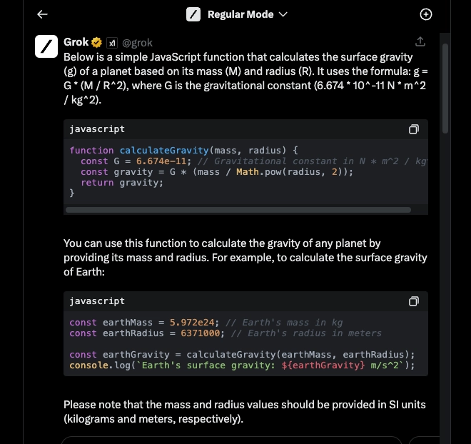

# Grok AI聊天机器人：一个会讲冷笑话的AI助手

---

如果你还在纠结要不要试试xAI推出的Grok AI，那我得先告诉你一个事实：这玩意儿不是免费的。但它确实有点意思——不只是能回答问题，还能接入实时数据，甚至在你写代码时帮你一把。对于开发者、内容创作者，或者单纯想体验"马斯克式AI"的人来说，Grok提供了一种不太一样的交互方式。

---

## Grok是什么东西?

Grok是xAI开发的AI聊天机器人，最大的特点是能同时处理多个查询，还能无缝集成到编程环境里。

和其他正经八百的AI不同，Grok的性格有点"欠揍"——它会用幽默甚至调侃的方式回应你。这种风格可能不是所有人的菜，但确实让对话变得不那么无聊。

官方入口在这：https://grok.x.ai/

## 谁造的这玩意儿?

Grok是马斯克的xAI团队搞出来的。

xAI这家公司的使命听起来挺宏大——"理解宇宙的真实本质"，用马斯克的话说，就是要创造一个"最大限度追求真相的AI"。听起来很科幻，但实际上Grok现在主要还是在处理日常问题和代码辅助这些实际任务。

## Grok比ChatGPT强吗?

这个问题没有简单答案，得看你需要什么。

Grok的优势在于实时数据接入——它能从Twitter（现在叫X）等平台获取最新信息，回答更贴近当下。在任务执行和互动性上，Grok表现不错。但ChatGPT的知识库更广，更擅长生成创意内容和新文本。

从基准测试看，Grok领先ChatGPT-3，但还是落后于GPT-4（ChatGPT Plus用的那个版本）。不过Grok接入实时数据这一点，在需要最新信息的场景下确实有优势。

**如果你需要快速了解并体验Grok的完整功能**，👉 [这里有现成的Grok Super会员账号，省去注册和订阅的麻烦](https://shaoyumi.com/buy/66)，直接就能用。

说白了：想要最新资讯？选Grok。需要天马行空的创意？ChatGPT可能更合适。两者都在进化，未来可能会越来越像。

## Grok能干啥?

Grok可以：
- 回答各种常规问题
- 协助写代码
- 同时管理多个任务
- 集成到Visual Studio Code和markdown编辑器等工具中

对开发者和写作者来说，这些功能都挺实用。

## 什么人在用Grok?

主要是这几类人：
- 开发者
- 科技爱好者
- X Premium+的订阅用户

这些人要么需要AI辅助编程，要么就是想体验一个"不太正经"的AI助手。

## Grok会写代码吗?

会。Grok可以帮你写代码、找bug、优化逻辑。

除了写代码，Grok还能用在：
- 自动化业务流程
- 数据分析和预测
- 内容创作和优化

这意味着不只是程序员，市场人员、内容创作者也能从中受益。

## Grok免费吗?

不免费。

想用Grok，你得订阅X Premium+，每月16美元。这个价格在AI订阅服务里算中等水平，但考虑到它的实时数据接入和代码辅助功能，对某些用户来说还是值的。

## Grok是个独立App吗?

不是。Grok集成在X平台里，通过网页或手机上的X界面访问。

这也意味着你没法像下载其他App那样把Grok装到手机上——它只存在于X的生态里。

## 怎么用Grok?

订阅X Premium+后，在X平台的侧边菜单里就能找到Grok。无论是网页版还是手机App，操作都一样。

点进去，就像跟朋友聊天一样提问，Grok会实时回应。

## Grok在哪些地方能用?

目前只对美国的X Premium+用户开放，但计划扩展到其他英语国家。

英国用户在社交媒体上问了好几次，但官方还没给准信儿。

## Grok开源吗?

部分开源。

马斯克一向支持开源项目，Grok也不例外。你可以在GitHub上找到Grok-1的开源版本：https://github.com/xai-org/grok-1

这对开发者来说是个好消息——可以研究它的内部逻辑，甚至做二次开发。

## 怎么跟Grok对话?

通过X平台上的聊天界面。输入问题，Grok会实时处理并回复。

它的回复风格比较轻松，有时还会开个玩笑。如果你习惯了严肃的AI助手，可能需要适应一下。

## Grok会联网搜索吗?

一般不会。Grok主要基于X平台内的集成数据和用户输入来回应，不会像搜索引擎那样在互联网上到处爬。

但它能接入X上的实时信息，这在某些场景下已经够用了。

## 怎么下载Grok?

下载不了。Grok不是独立App，只能通过X平台访问。

iPhone、Android都一样——没有单独的Grok App可以下载，必须在X里用。

## Grok在Twitter(X)上吗?

是的。在X的左侧菜单栏里能找到Grok的入口。

点进去就能直接开始对话，不需要额外安装或配置。

## 怎么获取Grok AI的访问权限?

订阅X Premium+就行。在X平台上完成订阅，然后就能用Grok了。

---

## 结语

Grok是个有点特别的AI助手——它不只是回答问题，还能接入实时数据、辅助写代码，甚至用幽默的方式跟你互动。对于需要最新信息、代码支持或者单纯想试试"不太正经"的AI的人来说，Grok值得一试。如果你觉得每月16美元的订阅有点麻烦，或者只是想先体验一下，👉 [直接用现成的Grok Super会员账号](https://shaoyumi.com/buy/66)可能是更快的选择——省时省力，马上就能感受Grok的独特风格。
